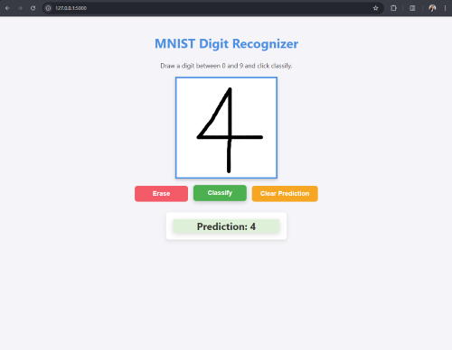

# MNIST Digit Recognizer

This interactive platform allows users to draw digits and classify them using a neural network trained on the MNIST dataset. It provides a hands-on experience of how neural networks can recognize handwritten digits. 

## Preview
Below are previews of the digit classifier in action:


A user drawing a digit.


The prediction result after classification.

## Table of Contents
- [Features](#features)
- [Tech Stack](#tech-stack)
- [Project Structure](#project-structure)
- [Installation](#installation)
- [Running the Application](#running-the-application)
- [Usage](#usage)
- [Model](#model)

## Features
- Draw a digit between 0 and 9 on a canvas.
- Classify the drawn digit using a pre-trained neural network (MNIST dataset).
- Clear the canvas to draw again.
- Display the predicted digit after classification.
- Responsive design for both desktop and mobile users.

## Tech Stack
- **Frontend**: HTML, CSS, JavaScript (Canvas API)
- **Backend**: Python, Flask
- **Machine Learning Model**: TensorFlow / Keras (MNIST model)
- **Other Dependencies**: 
  - NumPy (for data manipulation)
  - PIL (Python Imaging Library, for image processing)
  - Base64 and IO (for handling image data transfer)

## Project Structure

```
mnist-digit-recognizer/
├── app.py                   # Main Flask app
├── mnist_model.h5            # Pre-trained MNIST model
├── README.md                 # Project README
├── requirements.txt          # List of dependencies
├── static/
│   ├── css/
│   │   └── styles.css        # Custom CSS for the project
│   ├── js/
│   │   └── app.js            # Frontend JavaScript for canvas interactions
│   └── images/               # Placeholder for additional images (if needed)
└── templates/
    └── index.html            # Main HTML file
```

## Installation

1. **Clone the repository**:
   ```bash
   git clone https://github.com/IsharaParanagamaGedara/DigitClassifier-Flask-Application.git
   cd DigitClassifier-Flask-Application
   ```

2. **Set up a virtual environment** (recommended):
   ```bash
   python3 -m venv venv
   source venv/bin/activate   # For Linux/Mac
   # or 
   venv\Scripts\activate      # For Windows
   ```

3. **Install the required dependencies**:
   ```bash
   pip install -r requirements.txt
   ```

4. **Download or place the pre-trained MNIST model** (`mnist_model.h5`) in the project root folder. You can train the model using the `MNIST` dataset if you don't have one.

## Running the Application

1. **Start the Flask app**:
   ```bash
   python app.py
   ```

2. **Access the app**:
   Open your browser and go to:
   ```
   http://127.0.0.1:5000
   ```

## Usage

1. **Draw a Digit**:
   Use your mouse (or touch screen) to draw a digit between 0 and 9 on the canvas.

2. **Classify**:
   Once you have drawn a digit, click the **Classify** button to predict the digit using the trained neural network.

3. **Erase**:
   Click the **Erase** button to clear the canvas and draw a new digit.

4. **Clear Prediction**:
   Click **Clear Prediction** to reset the prediction display.

## Model

The model used for classification is a **Convolutional Neural Network (CNN)** trained on the **MNIST dataset** using **Keras** with the following layers:
- 3 convolutional layers with batch normalization
- Max pooling after each convolutional layer
- Fully connected layers for classification
- Dropout layers for regularization

